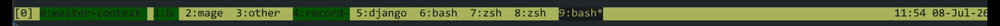

# claude-tmux-status

Show what [Claude Code](https://claude.com/claude-code) is doing right now, right in your **tmux status bar**.

When Claude is running inside a tmux window, this hook recolors that window's
entry in the status bar to reflect Claude's live state — so you can tell at a
glance which of your windows is busy versus waiting on you. It only changes the
*color*; your window **name is left exactly as you set it**.



```
[0] 0:dash  1:b  2:mage  3:other  4:zsh  5:django  6:bash  7:zsh  8:zsh  9:bash*
                                                            └─ green = Claude finished, waiting on you
```

## States

Your window **name never changes** — only its color in the status bar:

| Style         | Meaning                                        |
| ------------- | ---------------------------------------------- |
| reverse video | Claude is busy — thinking or running a tool    |
| green         | Claude finished / is waiting for your input    |
| default       | Claude Code exited (styling cleared)           |

## Your window name is left alone

This hook **never renames your window** — it only recolors it. To make sure your
title actually stays put, it also locks the window against the *other* things that
would rename it:

- tmux's `automatic-rename`, which names a window after its foreground process
  (e.g. `bash`, or `2.1.210` — Claude names its process after its version), and
- the shell's title escape sequences (`allow-rename`).

Both are turned off for the window, so your title is preserved 100% of the time.
The lock stays on even after Claude exits, so the name can't drift later either.
If you actually want a window back on tmux auto-rename, run
`tmux set-window-option automatic-rename on` for it.

**Background agents.** The `Stop` event fires when the main agent finishes even if
tasks launched with `run_in_background` are still working. The hook reads the
`background_tasks` field from the `Stop` payload and, if anything is still
running, keeps the window in the "busy" color and defers the chime until the last
background task finishes — so it won't signal "done" early.

## How it works

A single hook script, `tmux-status.sh`, is wired to six Claude Code hook events
(`SessionStart`, `UserPromptSubmit`, `PreToolUse`, `Stop`, `Notification`,
`SessionEnd`). On each event it reads the payload from stdin, figures out which
tmux window it's running in (via `$TMUX_PANE`), and sets that window's *style*
with `tmux set-window-option`. It never renames the window. It's a no-op outside
tmux.

All styling is applied dynamically by the script — **no `.tmux.conf` changes are
required**.

## Sound when Claude finishes (macOS)

When Claude finishes (the window turns green), the hook can play a sound — but
**only if you're not already looking at that window**. If your terminal is
frontmost *and* Claude's tmux window is the active one, it stays silent; if
you're in another app, or another tmux window, it chimes.

It's on by default on macOS (uses `lsappinfo` + `afplay`) and a no-op elsewhere.
Configure via environment variables in your `~/.claude/settings.json` env or
shell:

| Variable                   | Default | Meaning                                                                                 |
| -------------------------- | ------- | --------------------------------------------------------------------------------------- |
| `CLAUDE_TMUX_SOUND`        | `Pop`   | A macOS system-sound name (see `/System/Library/Sounds`), a path to a sound file, or `off` to disable. |
| `CLAUDE_TMUX_TERMINAL_APP` | *(auto)* | Comma-separated app name(s) that count as "your terminal", e.g. `iTerm2` or `Ghostty,Code`. |

`CLAUDE_TMUX_TERMINAL_APP` exists because tmux overwrites `$TERM_PROGRAM`, so the
host terminal can't be auto-detected. Without it, the hook matches the frontmost
app against a built-in list of common terminals (iTerm2, Terminal, Ghostty,
WezTerm, Alacritty, kitty, Warp, Code, Cursor, …). Set it if you use a terminal
that isn't recognized, or run more than one.

## Requirements

- [tmux](https://github.com/tmux/tmux)
- [jq](https://jqlang.github.io/jq/)
- Claude Code

## Install

```bash
git clone https://github.com/alexose/claude-tmux-status.git
cd claude-tmux-status
./install.sh
```

The installer copies `tmux-status.sh` into `~/.claude/hooks/` and merges the
required hook events into `~/.claude/settings.json` (backing it up first). It's
idempotent and won't duplicate entries on re-runs. Set `CLAUDE_CONFIG_DIR` to
target a non-default config directory.

Restart any running Claude Code sessions afterward to pick up the hooks.

## Manual install

If you'd rather not run the script:

1. Copy `tmux-status.sh` to `~/.claude/hooks/tmux-status.sh` and `chmod +x` it.
2. Merge the contents of `settings.hooks.json` into your `~/.claude/settings.json`
   (combine the `hooks` blocks if you already have one).

## Uninstall

Remove the `~/.claude/hooks/tmux-status.sh` entries from the `hooks` block in
`~/.claude/settings.json` (or restore a `settings.json.bak.*` backup the installer
made), and delete `~/.claude/hooks/tmux-status.sh`.

## License

MIT
